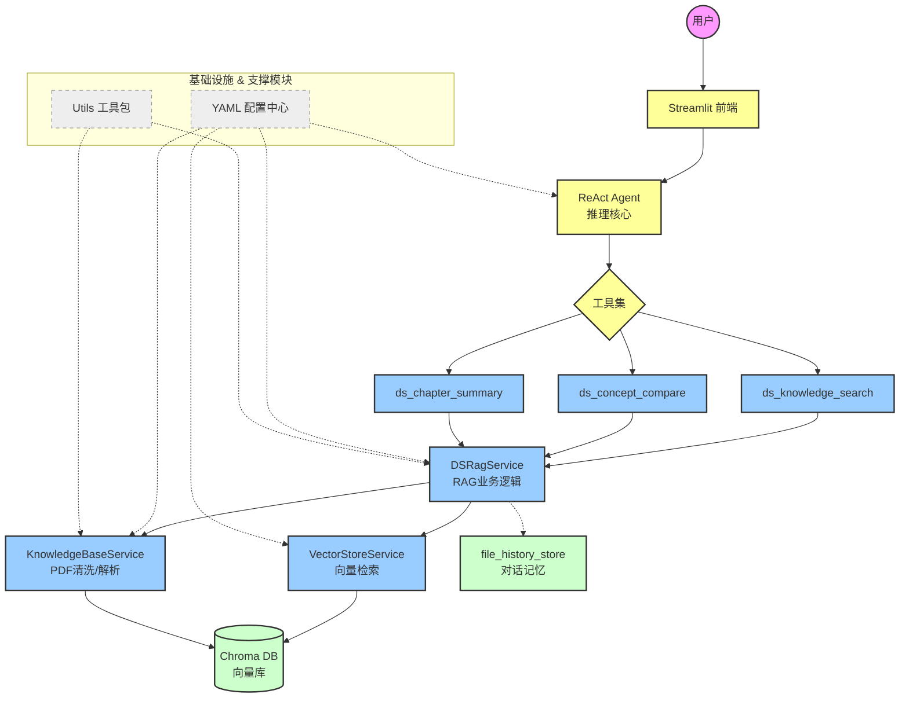

# 📚 DS-408-RAG-Agent

> 基于 RAG + ReAct Agent 的王道408考研智能答疑系统 | [在线Demo](https://ds-408-rag-agent.streamlit.app)

## ✨ 核心亮点

- **📍 页码溯源**：检索结果精确到【文件名 第X页】，全链路保留 `source` 和 `page_num` 元数据，回答可验证
- **🔧 ReAct Agent**：自动选择检索/对比/总结工具，实现“思考-调用-回答”闭环
- **🧹 入库清洗**：自动去除水印、页码、PPT噪声词，提升检索质量
- **⚙️ 配置解耦**：YAML 集中管理 + 独立 Prompt 模板，换模型/改参数无需改代码
- **💾 MD5去重**：已入库 PDF 自动跳过，避免重复处理
- **💬 上下文对话记忆**：支持多轮连续问答，持久化保存历史对话语境
## 🛠️ 技术栈

| 类别 | 技术 |
|------|------|
| 语言 | Python |
| 大模型 | 通义千问 (DashScope) |
| 向量库 | ChromaDB |
| 框架 | LangChain + ReAct Agent |
| 配置管理 | YAML |
| 前端 | Streamlit |
| 部署 | Streamlit Cloud |

## 系统架构



## 📂 项目结构

```text
DS-408-RAG-Agent/
├── requirements.txt
├── .gitignore
├── .python-version
│ 
├── react_agent.py                # **ReAct 智能推理循环**（核心功能）
├── streamlit_app.py              # 线上部署入口
│
├── tools/                        # 工具模块
│   └── agent_tools.py               # 多工具调用支持 
│ 
├── rag/                          # RAG 检索增强模块
│   ├── ds_rag_service.py            # RAG 核心业务逻辑
│   ├── KnowledgeBaseService.py      # （特色功能）**PDF水印自动去除 + 结构化知识点解析**
│   ├── vector_store.py              # 向量库存储与相似度检索
│   └── file_history_store.py        # （特色功能）**长对话记忆 / 历史上下文持久化**
│
├── model/                        # 模型工厂
│   └── factory.py                   # 大模型 & 嵌入模型统一管理
│
├── config/                       # 配置中心（YAML 工程化）
│   ├── agent.yml                    # Agent 工具与参数配置
│   ├── rag.yml                      # 分块、检索策略配置
│   ├── chroma.yml                   # 向量库持久化配置
│   └── prompts.yml                  # 提示词模板配置
│
├── prompts/                      # 提示词模块
│   └── main_prompt.txt              # 408考研专属系统提示词
│
├── utils/                        # 通用工具
│   ├── config_handler.py            # 配置加载
│   ├── logger_handler.py            # 日志系统
│   ├── path_tool.py                 # 路径管理
│   └── prompt_loader.py             # 提示词加载
│
└── chroma_db/                       # 文本向量库


```


## 🚀 快速开始

本项目已包含预处理的向量数据库，克隆后即可直接体验问答功能，无需重新处理 PDF。
### 1. 克隆项目与安装依赖

```bash
# 克隆仓库
git clone https://github.com/yourusername/DS-408-RAG-Agent.git
cd DS-408-RAG-Agent

# 创建虚拟环境 (推荐)
python -m venv venv
# Windows:
venv\Scripts\activate
# macOS/Linux:
source venv/bin/activate

# 安装依赖
pip install -r requirements.txt
```
### 2. 在项目根目录下创建 .env 文件，填入你的通义千问 API Key：
```bash
DASHSCOPE_API_KEY=sk-xxxxxxxxxxxxxxxxxxxxxxxx
```
### 3. 直接运行 Streamlit 应用即可开始问答：
```bash
streamlit run streamlit_app.py
```


## ❀ 温馨提示
若要查看项目的完整构建过程，请移步至https://github.com/pain-too/study_record